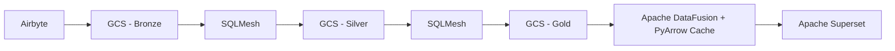

# Arquitetura do Projeto

## Visão Geral
Este projeto implementa um **Business Intelligence as Code (BIaaC)** baseado no **Google Cloud Platform (GCP)**, utilizando **Airbyte**, **SQLMesh**, **Apache DataFusion**, **PyArrow** e **Apache Superset** para um pipeline escalável de ingestão, transformação e análise de dados.

A solução segue o modelo **Medalhão** (Bronze, Silver e Gold) para gerenciamento eficiente de dados e utiliza **Cloud Run** para deploy dos serviços, garantindo escalabilidade e flexibilidade.

## **Componentes Principais**

### **1. Ingestão de Dados (Airbyte)**
- Airbyte captura dados de fontes transacionais (bancos, APIs, arquivos CSV) e armazena no **Google Cloud Storage (GCS)**.
- Dados são salvos na **camada Bronze** no formato Parquet.

### **2. Transformação de Dados (SQLMesh)**
- SQLMesh processa os dados das camadas **Bronze → Silver → Gold**.
- Transformações são definidas em SQL e Python.
- Dados são armazenados no GCS em formato otimizado (Parquet particionado).

### **3. Motor de Consulta e Cache (Apache DataFusion + PyArrow)**
- Apache DataFusion consulta os arquivos Parquet diretamente do GCS.
- PyArrow mantém um cache dos dados da **camada Gold** para melhorar a performance.

### **4. Visualização de Dados (Apache Superset)**
- Superset conecta-se ao cache **DataFusion** ou diretamente ao **GCS**.
- Dashboards e relatórios fornecem insights em tempo real.

### **5. Infraestrutura (Terraform + Cloud Run)**
- Terraform gerencia a infraestrutura (GCS, Cloud Run, IAM roles).
- Serviços são containerizados e executados no **Cloud Run**.

## **Fluxo de Dados**
1. **Airbyte** coleta e armazena dados no GCS (camada Bronze).
2. **SQLMesh** processa e estrutura os dados nas camadas **Silver e Gold**.
3. **DataFusion** lê os dados da camada Gold e aplica caching com **PyArrow**.
4. **Superset** acessa os dados cacheados e exibe insights em dashboards interativos.

## **Benefícios da Arquitetura**
✅ **Baixo custo** (usa armazenamento barato no GCS + DataFusion como engine leve).
✅ **Escalabilidade** (Cloud Run ajusta automaticamente os serviços conforme demanda).
✅ **Flexibilidade** (Pipeline modular que pode integrar novas fontes facilmente).
✅ **Alta performance** (Uso de Parquet + PyArrow para otimização de consultas).

## **6. Arquitetura de Componentes**
### 🏗 **Diagrama do Pipeline**

### 🔹 **Camadas do Data Lake**
1. **Bronze**: Dados crus armazenados diretamente do Airbyte.
2. **Silver**: Dados limpos e processados pelo SQLMesh.
3. **Gold**: Dados agregados e otimizados para análise.

### 🔹 **Fluxo de Dados**
1. O **Airbyte** extrai dados de fontes transacionais e salva no GCS (camada Br
2. O **SQLMesh** transforma os dados da camada Bronze para Silver e Silver para
3. O **Apache DataFusion** lê a camada Gold e mantém um cache com PyArrow.
4. O **Superset** se conecta ao Apache DataFusion para exibição dos dashboards.

## **Próximos Passos**
- Melhorar a automação dos pipelines de dados.
- Implementar governança de dados e controle de qualidade.
- Explorar integrações adicionais com BigQuery para análises mais avançadas.
